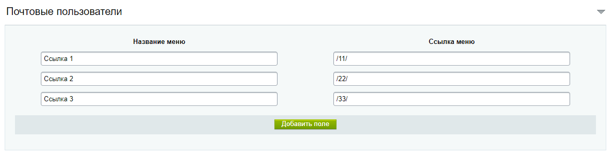
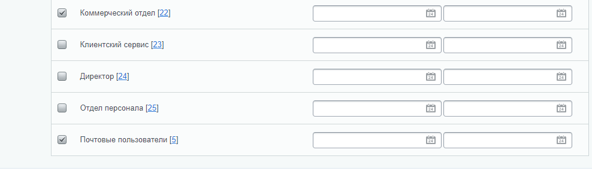

## onizamov.menumodifications

Модуль реализует возможность установки пунктов левого меню каждой группе пользователей.

Разработчик: [Низамов Олег](https://github.com/olegnizamov)

# API

### Логика работы

Модуль устанавливает для пользователя в его настройки left_menu_standard_items_s1 (таблица b_user_option) пункты меню, которые необходимо вывести. Установка срабатывает после события обновления и добавления пользователя в систему.

### Настройка модуля1) Для настройки левого меню для групп пользователей переходим в настройки модуля "[Модуль настройки левого меню пользователей](/bitrix/admin/settings.php?lang=ru&mid=onizamov.menumodifications&mid_menu=1)"

2) Для выбранной группы пользователей нажимаем "Добавить поле" и в пункте "Название меню" указываем название ссылки, а в пункте "Cсылка меню"
   
3) Переходим к пользователю и добавляем его в данную группу.
   **NB!** Если пользователь состоит в группе администраторы, то данная настройка на него не действует!

